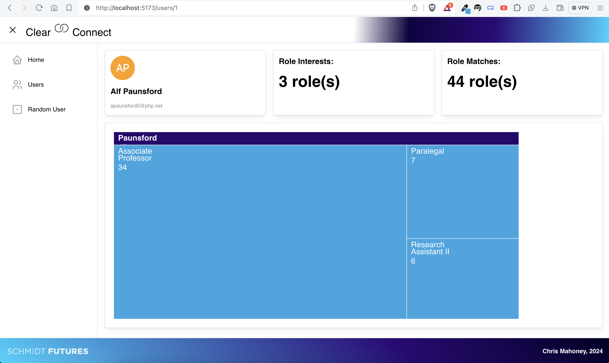

# Clear Connect
This project is a basic React application for use while interacting with the Schmidt Futures TGT Team test backend.



## Technologies used/Pre-requisites
The primary technologies used in this project are:
- [NodeJS v20 LTS](https://nodejs.org/en/download/package-manager/current): I tend to standardize on the last recent LTS versions of any tool I use day-to-day. That's v20 for Node, current is v22.2.0.
  - `yarn` for package management versus npm.
- [ReactJS](https://react.dev): A hardened frontend framework for webapp development.
- [React Router 6+](https://reactrouter.com/en/main): A mostly standard library for no-reload location transitions for React apps. I was surprised to find a major feature update in version 6, details of which can be found in the React Router section of the project breakdown.
- [Mantine UI](https://mantine.dev): A ReactJS component library that is designed to be consistent, accessible and easy to use. The Mantine Documentation site is able to easily onboard new developers utilizing it for a new or existing project. I believe Mantine accomplishes the goal of intuitive design, consistent styling and accessibility in a way that MaterialUI has yet to provide.
- [Vite](https://vitejs.dev), currently the easiest build system to use with Mantine as it is integrated into their template projects. There are also options to use webpack and other well-known build systems, but in my experience Vite is the easiest to get started with on fast MVP work.
- Started to reach for [Axios](https://github.com/axios/axios) for API calls which I have used on several projects, until encountering the updates to React Router. I chose to instead use standard fetch() calls for this project to keep the dependencies to a minimum while reducing the risk on this short-term exercise. Time to get started.

## Getting Started

### Manual Execution
The frontend can be executed using `yarn install`:

```
yarn install
yarn run dev
```

This will deploy the development server at `http://localhost:5173`, at which point you can then begin interacting with the application.

### Docker/Docker Compose (TODO: Not yet implemented)
Intention would be to either include this frontend deployment onboard the backend server host, or allow for execution in a separate container. My recommendation would be to include frontend, backend and hypothetical DB containers in a single docker-compose stack for ease of management. The below instructions are not implemented until the `docker-compose.yml` file is included on main branch.

- To use Docker (recommended), make sure to have Docker running per the exercise instructions for the backend, and use the `hello-world` tutorial deployment if you are new to using containers. 
- The docker image can be built from this repo using `docker image build -t sf-eng-frontend-cmahoney:latest .`
- Included docker-compose.yml file can be used to deploy the frontend, this would be intended to be used in conjunction with the backend deployment in a combined compose file.

### Project Structure
```
[Project Root]
├── App.css
├── App.tsx
├── assets
│   ├── data
│   │   ├── orgs.json
│   │   └── users.json
│   └── img
├── components
│   ├── AppFrame
│   │   ├── AppFrame.tsx
│   │   ├── AppSidebarMenu.tsx
│   ├── Cards
│   │   ├── OrgDetailCard.tsx (not in use)
│   │   └── UserDetail.tsx
│   ├── Charting
│   │   ├── HomeDashboard.tsx
│   │   └── Visualizers
│   │       ├── CollapsibleTreeVisualizer.tsx
│   │       ├── D3VisualizerBase.tsx
│   │       ├── NestedTreeVisualizer.tsx
│   │       ├── SunburstVisualizer.tsx
│   │       └── ZoomableTreemapVisualizer.tsx
│   ├── MatchGrid
│   │   └── MatchGrid.tsx
│   └── QueryBox
│       └── QueryBox.tsx
├── routes
│   ├── error-route.tsx
│   ├── home.tsx
│   ├── orgdetail.tsx
│   ├── orglist.tsx
│   ├── root.tsx
│   ├── userdetail.tsx
│   └── userlist.tsx
├── theme
│   └── AppTheme.tsx
├── index.css
├── main.tsx
└── vite-env.d.ts
```

## The Interface
The interface is a simple React application that allows for the following:

- Simple home page with a welcome message
- A tabular *User List* view to select from
- Ability to click a user record to display a *User Detail* view
  - Avatar, user info
  - Cards for interest and match counts
  - A D3-based visualization of user and role hierarchical data
    - Zoomable Treemap, click panes to zoom in or the top text bar to zoom back out.
    - Group matches by user interest, populate with match data about role and organization, TODO: potentially drill into the organization to continue exploring
- A *Random User* option to displays a random user by ID

## Node CLI Utility
Within the `cli` directory is `explorer.js`, which can be called via NodeJS to *evaluate the dataset associated with a user or an organiation*.

### Usage

#### User Evaluation
```
# Examine user 41
# $ node cli/explorer.js user 41

--- USER ------------------------
User: Bernadene Florentine
Interests: Nurse Practicioner,Actuary
Matches: 43
100 - Actuary  - Browsetype
100 - Actuary  - Wikizz
100 - Actuary  - Topicstorm
100 - Actuary  - Twitterbeat
100 - Actuary  - Zoonder
100 - Actuary  - Twiyo
100 - Actuary  - Skinder
100 - Actuary  - Mynte
100 - Actuary  - Mydo
100 - Actuary  - Camido
100 - Actuary  - Trilith
100 - Actuary  - Skidoo
100 - Actuary  - Oyoyo
100 - Actuary  - Livefish
100 - Actuary  - Pixonyx
100 - Actuary  - Zoovu
100 - Actuary  - Mybuzz
100 - Actuary  - Eabox
100 - Actuary  - Feedfish
100 - Actuary  - Oyope
100 - Actuary  - Bluejam
100 - Nurse Practicioner  - Meembee
100 - Nurse Practicioner  - Gigazoom
100 - Nurse Practicioner  - Ainyx
100 - Nurse Practicioner  - Edgepulse
100 - Nurse Practicioner  - Realcube
100 - Nurse Practicioner  - Twitterworks
100 - Nurse Practicioner  - Topicblab
100 - Nurse Practicioner  - Topicstorm
100 - Nurse Practicioner  - Rhyzio
90 - Nurse (Nurse Practicioner) - Skinix
90 - Nurse (Nurse Practicioner) - Skipfire
90 - Nurse (Nurse Practicioner) - Wikizz
90 - Nurse (Nurse Practicioner) - Zoonder
90 - Nurse (Nurse Practicioner) - Shufflebeat
90 - Nurse (Nurse Practicioner) - Jabberstorm
90 - Nurse (Nurse Practicioner) - Einti
90 - Nurse (Nurse Practicioner) - Tekfly
90 - Nurse (Nurse Practicioner) - Zooveo
90 - Nurse (Nurse Practicioner) - Gigaclub
90 - Nurse (Nurse Practicioner) - Skyba
90 - Nurse (Nurse Practicioner) - Snaptags
90 - Nurse (Nurse Practicioner) - LiveZ

--- WEIGHT AND VARIANCE ---
{ '90': 13, '100': 30 } { Actuary: 21, 'Nurse Practicioner': 9, Nurse: 13 }
User: Matches by Position match level
{
  Actuary: [
    100, 100, 100, 100, 100,
    100, 100, 100, 100, 100,
    100, 100, 100, 100, 100,
    100, 100, 100, 100, 100,
    100
  ],
  'Nurse Practicioner': [
    100, 100, 100,
    100, 100, 100,
    100, 100, 100
  ],
  Nurse: [
    90, 90, 90, 90, 90, 90,
    90, 90, 90, 90, 90, 90,
    90
  ]
}

--- POSITION SUCCESS ---
-- Actuary:
---- 21 matches, grade: 100
-- Nurse Practicioner:
---- 9 matches, grade: 100
-- Nurse:
---- 13 matches, grade: 90

--- USER OVERALL SUCCESS ---
96.97674418604652
Processing complete.
```

#### Organization Evaluation
```
# Examine org 21
# $ node cli/explorer.js org 21

--- ORG ------------------------
Org: Youopia

--- WEIGHT AND VARIANCE ---
{ '90': 61, '92': 2, '96': 3, '100': 89 } {
  'Chemical Engineer': 10,
  'Director of Sales': 14,
  'Geologist II': 7,
  'Payment Adjustment Coordinator': 15,
  'Registered Nurse': 31,
  'Marketing Manager': 12,
  Operator: 27,
  Professor: 39
}

--- POSITION SUCCESS ---
-- Chemical Engineer:
---- 10 matches, grade: 100
-- Director of Sales:
---- 14 matches, grade: 100
-- Geologist II:
---- 7 matches, grade: 96
-- Payment Adjustment Coordinator:
---- 15 matches, grade: 100
-- Registered Nurse:
---- 31 matches, grade: 93.54838709677419
-- Marketing Manager:
---- 12 matches, grade: 100
-- Operator:
---- 27 matches, grade: 94.44444444444444
-- Professor:
---- 39 matches, grade: 93.33333333333333

--- ORG OVERALL SUCCESS ---
95.88387096774194
Processing complete.
```

TODO: Allow for CLI query by human-readable name, not just ID.